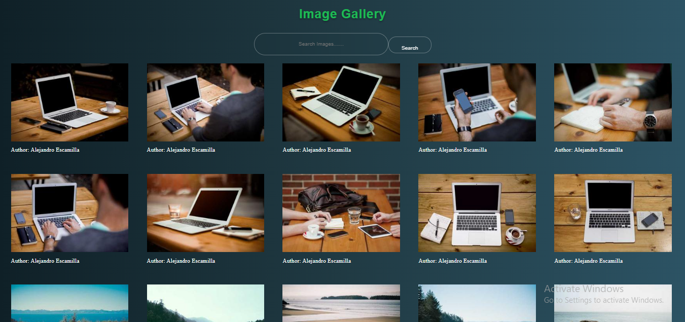

# 📸 Image Gallery in React.js



## 🚀 Overview

This project is a responsive and modern **Image Gallery** built using **React.js**. It allows users to view a collection of images in an organized and aesthetic layout. The gallery is easy to navigate, mobile-friendly, and ready to be extended with features like lightbox, filters, or API integration.

## ✨ Features

- 🔹 Fully responsive grid layout
- 🔹 Clean and modern UI
- 🔹 Modular and reusable components
- 🔹 Easily customizable image list
- 🔹 Built with functional components and React Hooks
- 🔹 Allow search image aurthor

## 🧰 Technologies Used

- ⚛️ React.js (with Create React App)
- 💅 CSS Modules / Styled Components (based on your project)
- 🖼️ Static images or dynamic image array

## 📁 Folder Structure
Image-Gallery/<br/>
├── public/<br/>
├── src/<br/>
│ │<br/>
│ ├── App.jsx<br/>
│ └── index.jsx<br/>
├── package.json<br/>
└── README.md<br/>

## 🔧 Installation

To get a local copy up and running:

```bash
# Clone the repository
git clone https://github.com/Majidali90121/image-gallery.git

# Navigate to the project directory
cd image-gallery

# Install dependencies
npm install

# Start the development server
npm start
```
- API use Picsum
